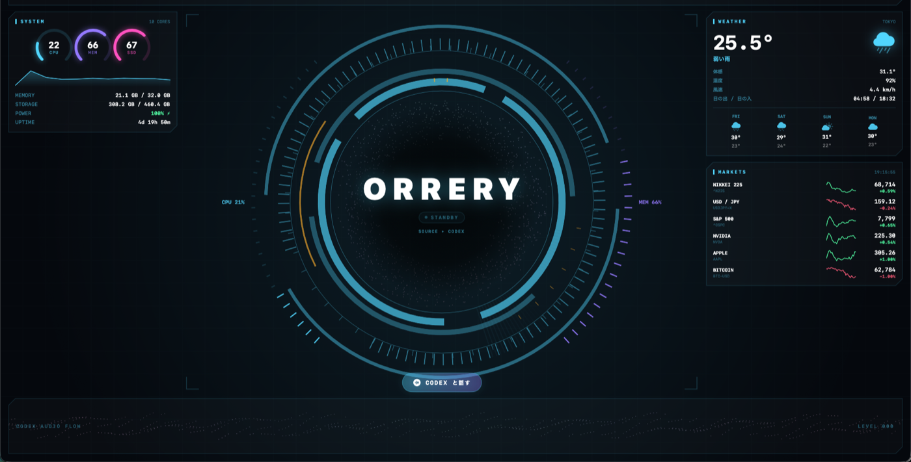
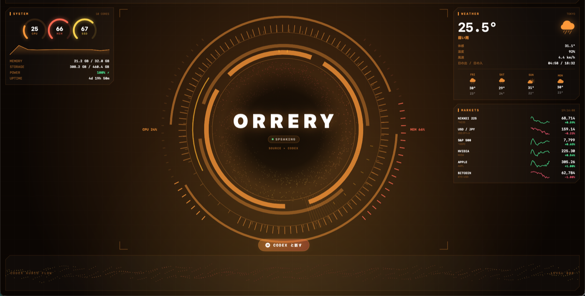
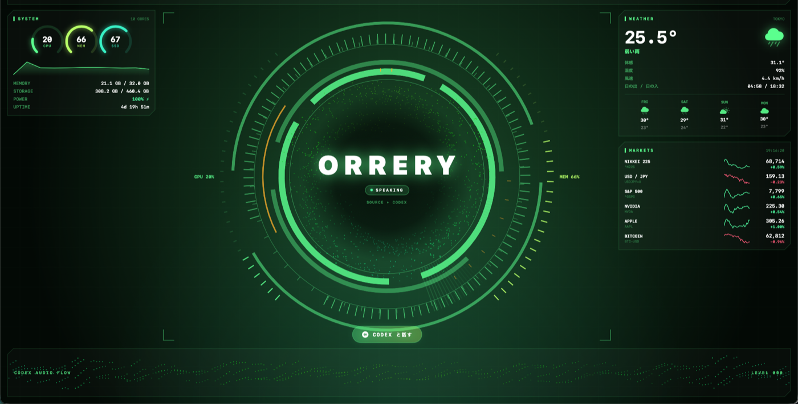

# ORRERY

> This repository (`voice-ai-client`) vendors the source from [ito-ops/orrery](https://github.com/ito-ops/orrery) (MIT License). Note any deviations from upstream, or repo-specific context, in this section.


[](https://github.com/ito-ops/orrery/releases/latest)

[日本語のREADME →](README.md)

A full-screen HUD dashboard for macOS. The arc reactor in the center reacts to the voice of the Codex app, surrounded by the date, weather, stock prices, system stats, and your Claude usage.



Color themes can be switched in Settings (⌘,).

| EMBER | MATRIX |
| --- | --- |
|  |  |

## Install

### Download

1. Grab `Orrery-vX.X.X-macos.zip` from the [latest release](https://github.com/ito-ops/orrery/releases/latest) and unzip it
2. Move `Orrery.app` to `~/Applications` (or `/Applications`)
3. The app is not notarized (it's free software), so Gatekeeper blocks the first launch. Strip the quarantine attribute:

```bash
xattr -cr ~/Applications/Orrery.app
```

(Right-click → Open also works. If it still won't open, use "Open Anyway" at the bottom of System Settings › Privacy & Security.)

All source code is public — build from source below if you prefer.

### Build from source

With Xcode or the Command Line Tools installed:

```bash
git clone https://github.com/ito-ops/orrery.git
```

```bash
cd orrery && ./ORRERYを起動.command
```

The script builds the app, assembles `~/Applications/Orrery.app`, and launches it. Microphone / speech-recognition / screen-recording permissions are recorded per app bundle, so voice features do not work with a bare `swift run` binary.

Quit with ⌘Q.

### Required permissions

| Permission | Used for | When asked |
| --- | --- | --- |
| Screen Recording | Reading Codex's audio level (no video is saved) | First launch |
| Accessibility | Sending ⌘N / ⌃⇧V to Codex | First press of "Talk to CODEX" |
| Microphone & Speech Recognition | Voice wake | First time you enable voice wake |

When screen recording is not permitted, the center shows `SOURCE ▸ NO ACCESS` with a button that opens the settings pane.

**Screen Recording must be added manually.** macOS does not show the automatic permission dialog for ad-hoc-signed apps (`CGRequestScreenCaptureAccess()` returns false), so:

1. System Settings › Privacy & Security › Screen Recording
2. Click "+" and pick `~/Applications/Orrery.app`
3. Turn the toggle on
4. Relaunch the app

**Rebuilding changes the signature (cdhash), which drops this permission.** If redoing it every time is annoying, you can create a self-signed certificate to pin the signature.

## Choosing the audio source

The two buttons at the top select what sound the HUD reacts to.

| Button | Meaning |
| --- | --- |
| `CODEX ONLY` / `ALL AUDIO` | Only the Codex app's audio, or the whole system. Codex sometimes plays audio from a separate process, so `CODEX ONLY` may miss it |
| `MY VOICE` | Mixes in the microphone. **Your own voice during a Codex conversation comes through the mic**, so the HUD won't react to you unless this is on |

System audio and the mic are merged by taking the larger value per band.

## What's on screen

| Area | Content |
| --- | --- |
| Top left | Clock and date |
| Top | Hostname / IP / cores / uptime, refresh button, window-mode toggle |
| Left | CPU / memory / storage / power / network traffic, Claude usage (estimate) |
| Center | The ORRERY rings, CPU/MEM segment gauges, voice session button |
| Right | Weather (current + 4-day forecast), stocks & FX |
| Bottom | A stream of sand that flows with Codex's audio |

The particles in the center and bottom always drift slowly, and light up with color while Codex is speaking.

## Capturing only Codex's audio

A ScreenCaptureKit filter analyzes audio only from Codex (`com.openai.codex`, displayed as ChatGPT) and CodexBar. Target apps are watched every 6 seconds and switch automatically as they launch or quit. When no target is found it falls back to system-wide audio and shows `SOURCE ▸ SYSTEM (no target)`.

## Talking to Codex by voice

Pressing "Talk to CODEX" under the center:

1. Brings the Codex app (`com.openai.codex`) to the front
2. Creates a new chat with **⌘N** (`newTask`)
3. Opens voice mode with **⌃⇧V** (`composer.startVoiceMode`)
4. Switches the HUD to **always on top**

Each press starts a fresh chat, so previous conversations don't mix in. Pressing again restores the previous window mode and brings Codex back to the front.

Because keys are sent to another app, the HUD needs approval in **System Settings › Privacy & Security › Accessibility**. Without it, the app still comes to the front — just press ⌘N → ⌃⇧V in Codex yourself.

## Voice wake

Press "VOICE OFF" at the top right to start listening; saying one of the wake phrases acts like pressing the button.

- Default phrases: `オレリー` / `コーデックス` / `orrery` / `hey codex`
- Recognition happens **on-device only** (`requiresOnDeviceRecognition`); audio is never stored or sent anywhere
- Ignored during a session (so Codex's own voice doesn't retrigger it); after firing, it won't fire again for 6 seconds
- The last heard phrase appears at the top — handy when a phrase isn't recognized
- The setting persists across launches

The first activation asks for **Microphone** and **Speech Recognition** permissions.

## Window handling

Behaves like a normal app window.

| Action | How |
| --- | --- |
| Move | Drag anywhere (there's no title bar, grab the background) |
| Resize | Drag the edges. Minimum 900×600 |
| Fill the screen | ⌘0 |
| Small, centered | ⌘9 |
| Minimize / close / quit | ⌘M / ⌘W / ⌘Q |
| Cycle window mode | ⌘T or the top-right button |

Shows up in Mission Control, App Exposé, and window tiling. Position and size are restored on the next launch.

## Window modes

The top-right button (or ⌘T) cycles through three modes.

| Mode | Stacking | Movable | Mission Control |
| --- | --- | --- | --- |
| **Normal** | Regular window | Yes | Yes |
| **Front** | Always on top, all Spaces | Yes | Yes |
| **Desktop** | Above the wallpaper, below all windows | No | No |

## Settings

Open Settings with ⌘, (or the gear button at the top right). Settings persist across launches.

| Tab | Contents |
| --- | --- |
| General | Weather location, stock/FX tickers, voice wake phrases |
| Theme | 5 palettes (ARC / EMBER / MATRIX / CRIMSON / MONO) + a custom color. Pick one color and the rest is derived |
| Panels | Toggle each panel and the bottom sand stream. Hiding a whole column widens the center |
| Performance | Particle count, frame rates |

## Environment variables

Everything is configurable from the Settings window, but environment variables override it. Priority: **env var > Settings > default**.

| Variable | Default | Meaning |
| --- | --- | --- |
| `HUD_CITY` | `TOKYO` | Name shown in the weather panel |
| `HUD_LAT` / `HUD_LON` | Tokyo | Weather location |
| `HUD_TICKERS` | 6 tickers (Nikkei, USD/JPY, …) | Market panel tickers as `SYMBOL:LABEL` pairs, comma-separated (e.g. `^N225:NIKKEI 225,BTC-USD:BITCOIN`) |
| `HUD_AUDIO_APPS` | `codex` | Apps to capture audio from (substring of name or bundle id, comma-separated) |
| `HUD_WAKE_PHRASES` | `オレリー,コーデックス,orrery,hey codex` | Voice wake phrases (comma-separated) |
| `HUD_WAKE_LOCALE` | `ja-JP` | Speech recognition locale |
| `HUD_GRAINS` | `1100` | Particle count (0 disables particles) |
| `HUD_FPS` / `HUD_IDLE_FPS` | `30` / `12` | Frame rate while audio is live / idle |
| `HUD_STATIC` | `0` | `1` freezes all animation (lightest) |
| `HUD_WINDOW` | none | Initial size like `1200x800` |

Example:

```bash
HUD_CITY=OSAKA HUD_LAT=34.6937 HUD_LON=135.5023 swift run
```

## About CPU load

Redrawing a full-screen Canvas costs about 25–30% of one core even when idle. On a 10-core machine that's ~3% overall; to reduce it:

| Approach | Effect |
| --- | --- |
| Shrink the window (⌘9) | Less to draw |
| Launch with `HUD_STATIC=1` | Down to ~7% (particles and rings freeze) |
| Turn voice wake off | Removes the speech-recognition cost |

Measured: particle count, frame rate, and window size barely change the cost — **re-rendering the SwiftUI Canvas itself** is the fixed cost. Going lower would require moving drawing to AppKit (CoreGraphics).

## Data sources

- Weather: [Open-Meteo](https://open-meteo.com) (no API key)
- Stocks & FX: Yahoo Finance chart API (no API key)
- System stats: mach / IOKit / getifaddrs
- Claude usage: logs under `~/.claude/projects`. Only usage / timestamp / model / requestId are read — never conversation content

Resuming or branching a session copies past messages into a new log file, so naive summing over-counts by ~2.5×. Duplicates are dropped across files by `requestId` before aggregating.

Costs are **estimates** based on per-model rates guessed from the model name. Rates live in `UsageService.swift` in `rate(for:)`.

## Code layout

| File | Role |
| --- | --- |
| `App.swift` | Window setup, stacking modes, menus |
| `HUDView.swift` | Overall layout and the top bar |
| `HUDSettings.swift` | Settings storage (UserDefaults) |
| `HUDTheme.swift` | Theme palettes and custom-color derivation |
| `SettingsView.swift` | The Settings window (⌘,) |
| `OrreryDial.swift` | The center rings |
| `ParticleField.swift` | Particle colors and the bottom sand stream |
| `CenterStage.swift` | Clock and the Codex button |
| `HUDPanels.swift` | The panels |
| `HUDComponents.swift` | Shared components and colors |
| `AudioSpectrum.swift` | Audio capture and state |
| `WakeWordListener.swift` | Voice wake (on-device speech recognition) |
| `CodexLauncher.swift` | Opens Codex with a new chat + voice mode |
| `SpectrumAnalyzer.swift` | FFT |
| `SystemMonitor.swift` / `WeatherService.swift` / `MarketService.swift` / `UsageService.swift` | Data fetching |
| `AppResources/Info.plist` | Bundle Info.plist (usage strings, icon) |
| `AppResources/Orrery.icns` | App icon |
| `tools/make-icon.swift` | Icon generator script |

Look/reactivity is tuned in `AudioSpectrum.swift` (`Tuning`), ring radii in `OrreryDial.swift` (`R`).
